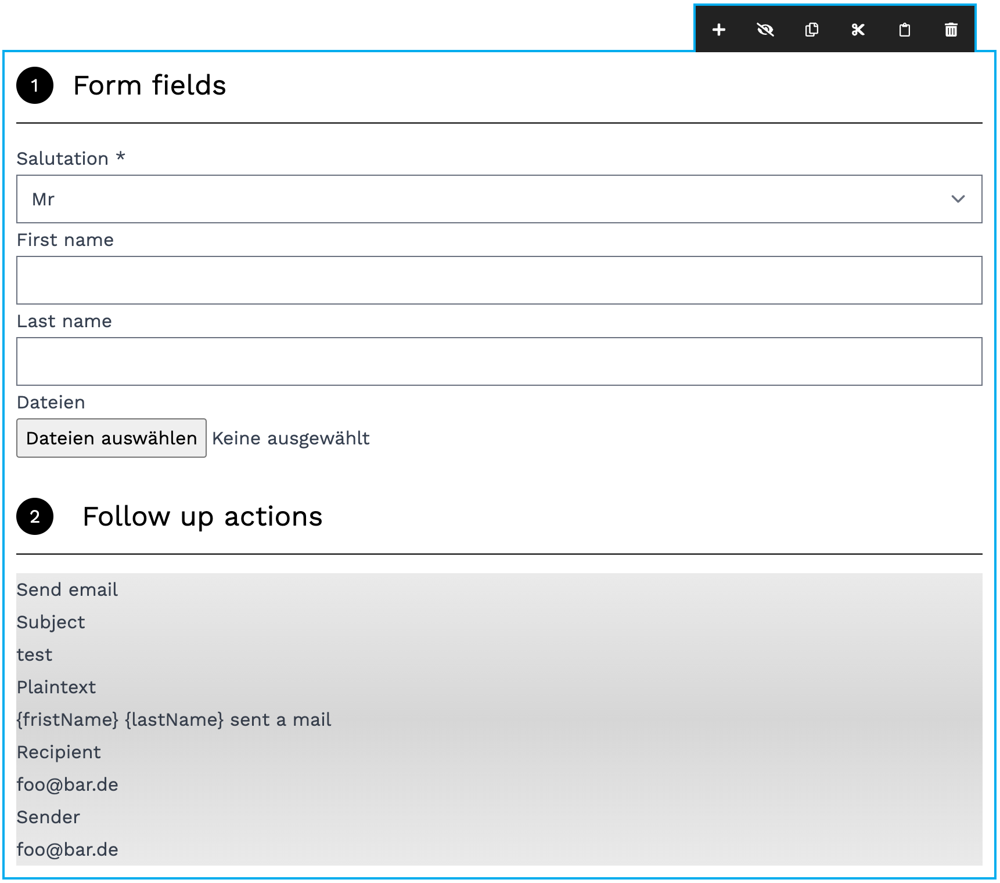
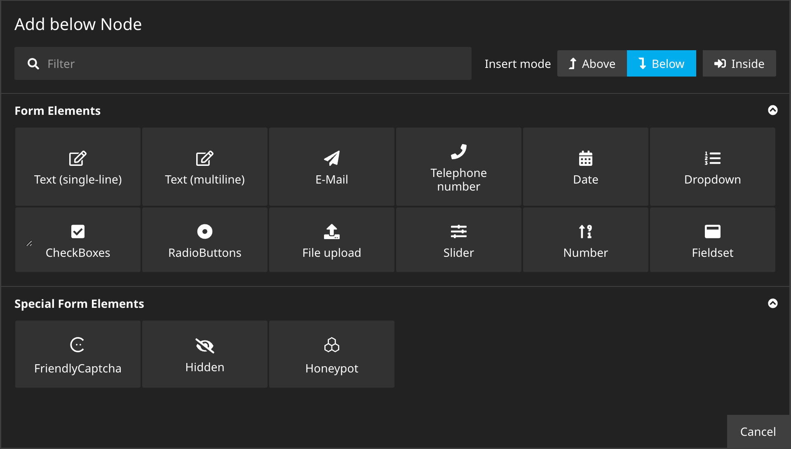
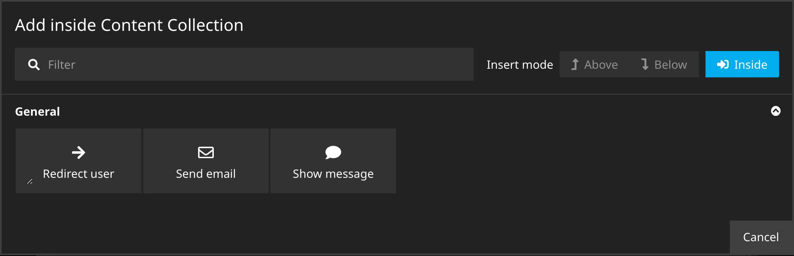

# Sitegeist.PaperTiger

## Form builder for Neos CMS based on Neos.Fusion.Form

This package allows editors to define simple forms and the submit action using nodes. Since the package is build on top
of [Neos.Fusion.Form](https://github.com/neos/fusion-form) the whole this package is designed to be easily adjustable
and extensible especially with custom rendering.

!!! This package does not and likely will never support MultiStep Forms. This is not a technical limitation, we simply
are
convinced that forms that require multiple steps should be implemented as frontend application !!!

!!! This package uses several other sitegeist packages as dependencies. !!!

### Authors & Sponsors

* Martin Ficzel - ficzel@sitegeist.de

*The development and the public-releases of this package is generously sponsored by our
employer http://www.sitegeist.de.*

## Installation

Sitegeist.PaperTiger is available via packagist run `composer require sitegeist/papertiger` to install.

We use semantic-versioning so every breaking change will increase the major-version number.

## Usage `Sitegeist.PaperTiger:Form`

The package adds the content prototype `Sitegeist.PaperTiger:Form` to Neos cms. This content allows to



### Form Contents, aka "Form fields"

The contents of the Form are defined as nodes in the section "Form fields" (fields, Sitegeist.PaperTiger:
Field.Collection).



The package comes with the following field NodeTypes, all of them can have a label and can be
declared as beeing required with additional constraints depending on the fieldtype.

- `Sitegeist.PaperTiger:Field.Text.SingleLine`
- `Sitegeist.PaperTiger:Field.Text.MultiLine`
- `Sitegeist.PaperTiger:Field.Dropdown` - Dropdown managing the available options as nested properties
  with [Sitegeist.InspectorGadget](https://github.com/sitegeist/Sitegeist.InspectorGadget)
- `Sitegeist.PaperTiger:Field.RadioButtons`
- `Sitegeist.PaperTiger:Field.CheckBoxes`
- `Sitegeist.PaperTiger:Field.Date`
- `Sitegeist.PaperTiger:Field.Email`
- `Sitegeist.PaperTiger:Field.Number`
- `Sitegeist.PaperTiger:Field.Slider`
- `Sitegeist.PaperTiger:Field.TelephoneNumber`
- `Sitegeist.PaperTiger:Field.Upload` - Upload field based
  on [Sitegeist.FusionForm.Upload](https://github.com/sitegeist/Sitegeist.FusionForm.Upload)
- `Sitegeist.PaperTiger:Field.Fieldset` - A group of fields with a common label.

Special:

- `Sitegeist.PaperTiger:Field.Honeypot` - A invisible field that is validated to be empty
- `Sitegeist.PaperTiger:Field.Hidden` - A hidden field with the specified value
- `Sitegeist.PaperTiger:Field.FriendlyCaptcha` - Captcha
  using [Sitegeist.FusionForm.FriendlyCaptcha](https://github.com/sitegeist/Sitegeist.FusionForm.FriendlyCaptcha)

The NodeType `Sitegeist.PaperTiger:Field.Collection` accepts all contents with the
constraint `Sitegeist.PaperTiger:Field.Constraint`. During rendering
the contents with the supertype `Sitegeist.PaperTiger:Field` will be handled differently and are expected to be
implemented by a `NodeType.Name` and a `NodeType.Name.Schema`
as is described in section [Custom field NodeTypes](#custom-field-nodetypes).

### Follow up actions

The actions to be performed after the successful form submission are defined in the section "Follow up
actions"  (`actions`, `Sitegeist.PaperTiger:Action.Collection`).
The actions are configured in the inspector and show a preview in the backend.

- `Sitegeist.PaperTiger:Action.Message` - Show a specified `message` while replacing `{identifier}` with submitted data.
- `Sitegeist.PaperTiger:Action.Redirct` - Redirect the user to the specified Document afer submit.
- `Sitegeist.PaperTiger:Action.Email` - Email action
  using [Sitegeist.Neos.SymfonyMailer](https://github.com/sitegeist/Sitegeist.Neos.SymfonyMailer) 
  The properties `subject`, `text` and `html` will replace `{identifier}` with submitted data. Submitted files can be
  added as attachments. ([see config below](#disable-symfonymailer))

!!! During submission some properties will replace parts `{identifier}` with submitted data by applying the
processor `Sitegeist.PaperTiger:Action.DataTemplate`. !!!



## Configuration

### Disable SymfonyMailer

If SymfonyMailer doesn't work, change the configuration in your `settings.yaml` to disable it and use the default Neos `dsn`:

```yaml
Sitegeist:
    Neos:
        SymfonyMailer:
        dsn: 'native://default'
```

### Custom field NodeTypes

A new field NodeType is defined as a NodeType with the supertype `Sitegeist.PaperTiger:Field`.

```yaml
Sitegeist.PaperTiger:Field.Slider:
  ui:
    label: "Slider"
  superTypes:
    'Sitegeist.PaperTiger:Field': true
    'Sitegeist.PaperTiger:Mixin.Label': true
    'Sitegeist.PaperTiger:Mixin.IsRequired': true
  properties:
    minimumValue:
      type: integer
    maximumValue:
      type: integer
```

Other than usual contents NodeTypes with the `Sitegeist.PaperTiger:Field` supertype are expected to be implemented an
additional `NodeType.Name.Schema` prototype accompanying the default `NodeType.Name` renderer.

The `NodeType.Name` prototype specifies the frontend representation. It is recommended to wrap the rendered form into
a `Sitegeist.PaperTiger:FieldContainer` and
pass a `label` if this fits the nodetype.

```neosfusion
prototype(Sitegeist.PaperTiger:Field.Slider) < prototype(Neos.Neos:ContentComponent) {
  identifier = ${q(node).property('identifier')}
  label = ${q(node).property('label')}
  isRequired = ${q(node).property('isRequired')}
  minimumValue = ${q(node).property('minimumValue')}
  maximumValue = ${q(node).property('maximumValue')}

  renderer = afx`
    <Sitegeist.PaperTiger:FieldContainer
        field.name={props.identifier}
        label={props.label}
    >
      <Neos.Fusion.Form:Input
        attributes.type="range"
        attributes.required={props.isRequired}
        attributes.min={Type.isInteger(props.minimumValue) ? props.minimumValue : false}
        attributes.max={Type.isInteger(props.maximumValue) ? props.maximumValue : false}
      />
    </Sitegeist.PaperTiger:FieldContainer>
  `
}

```

After submission an `.Schema` NodeType is used to define the type mapping and validation. This NodeType is expected
to return a Schema as described
in [Neos.FusionForm:RuntimeFormBasics](https://github.com/neos/fusion-form/blob/master/Documentation/RuntimeFormBasics.md).

```neosfusion
prototype(Sitegeist.PaperTiger:Field.Slider.Schema) < prototype(Neos.Fusion:Component) {
  isRequired = ${q(node).property('isRequired')}
  rangeValidatorOptions = Neos.Fusion:DataStructure {
    minimum = ${q(node).property('minimumValue')}
    minimum.@if.isDefined = ${q(node).property('minimumValue')}

    maximum = ${q(node).property('maximumValue')}
    maximum.@if.isDefined = ${q(node).property('maximumValue')}
  }

  renderer = ${Form.Schema.integer()}
  renderer.@process.addIsRequired = ${props.isRequired ?  value.required : value}
  renderer.@process.addRangeValidator = ${props.rangeValidatorOptions ? value.validator('NumberRange', props.rangeValidatorOptions) : value}
}
```

### Custom action

A new action NodeType is defined as a NodeType with the supertype `Sitegeist.PaperTiger:Action`.

```yaml
Sitegeist.PaperTiger:Action.Message:
  ui:
      label: 'Show message'
  superTypes:
    'Sitegeist.PaperTiger:Action': true
  properties:
    message:
      type: string
```

Other than usual contents NodeTypes with the `Sitegeist.PaperTiger:Action` supertype are expected to be accompanied by
two fusion-prototype a `.Definition` and a `.Preview`
which are both prefixed with the name of the NodeType.

The `.Preview` prototype is expected to render an overview of the configuration for editors that is only visible in the
backend.

```neosfusion
prototype(Sitegeist.PaperTiger:Action.Message.Preview) < prototype(Neos.Fusion:Component) {
  message = ${q(node).property('message')}
  renderer = afx`
    {props.message}
  `
}

```

The `.Definition` prototype configures an action using the `Sitegeist.PaperTiger:Action` as renderer.
by applying `Sitegeist.PaperTiger:Action.DataTemplate` as processor those options can be configured to
replace `{identifier}` markers with submitted data.

```neosfusion
prototype(Sitegeist.PaperTiger:Action.Message.Definition) < prototype(Neos.Fusion:Component) {
  message = ${q(node).property('message')}

  renderer = Sitegeist.PaperTiger:Action {
    type = 'Neos.Fusion.Form.Runtime:Message'
    options {
      message = ${props.message}
      message.@process.asTemplate = Sitegeist.PaperTiger:Action.DataTemplate
    }
  }
}
```

#### Allow classic contents in forms.

To allow any contents that are derived from `Neos.Neos:Content` in a form the
constraint `Sitegeist.PaperTiger:Field.Constraint`
has to be added to the NodeTypes.

The example allows the use of `Text` and `Image` from Neos.Demo inside of forms:

```yaml
'Neos.Demo:Content.Text':
  superTypes:
    'Sitegeist.PaperTiger:Field.Constraint': true

'Neos.Demo:Content.Image':
  superTypes:
    'Sitegeist.PaperTiger:Field.Constraint': true
```    

### Customize rendering

#### Override defaults

The simplest way to adjust the rendering is overriding top level properties of the existing fusion prototyoes.
It is not recommended to use this on properties that are not on the top level.

```neosfusion
prototype(Sitegeist.PaperTiger:Form) {
    class = 'form my-8'
}

prototype(Sitegeist.PaperTiger:Error) {
    customErrorClass = 'form-errors'
}

prototype(Sitegeist.PaperTiger:SubmitButton) {
    class  = 'submit mt-8'
}
```

## Contribution

We will gladly accept contributions. Please send us pull requests.

## License

See [LICENSE](LICENSE)
